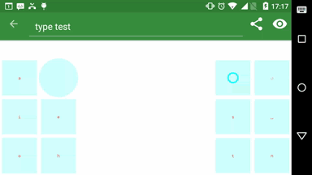

# Adellica's Chorded Keyboard

This is a 12-button chorded keyboard for Android. The objective is to
replace the standard QUERTY Touch-screen keyboards. It is heavily
inspired
by [Chorded keyboards](https://en.wikipedia.org/wiki/Chorded_keyboard)
and Alexander
Burger's [PentiKeyboard](https://software-lab.de/penti.html) in
particular. The keyboard is fully usable but not very
user-friendly. The transparency feature may misfunction in certain
apps.

- With only 12 buttons, they can be large and you rarely miss
- With only 12 buttons, you'll need to press multiple buttons
  simultaniously to access all the 26 letters of the alphabet
- With fewer key misses, you (hopefully) don't need a dictionary
- There are swipe gestures for pretty much all keyboard symbols
- You can define your own layouts
- It is probably very difficult to learn to use proficiently but
  possibly worth the effort!

## Configurable

The layout is fully customizable, and you're welcome to
experiment. Unfortunately, the process of changing a stroke this isn't
the most user-friendly experience at the moment. However, it can be
done directly from the keyboard itself. Try this:

Hit the "circled superlayout" button, and press `stroke write`. This
will dump the action of your subsequent stroke. So if you now tap on
`s`, it should print "key S" into your text editor at the current
cursor position.

Let's say you wanted the percentage sign `%` to appear if you swipe
from the bottom left to the bottom top, then you'd do this:

1. Type `shift 5` on a line on its own into a text editor
2. Press the "circled superlayout" button
3. Press "stroke record" (the current line will be associated with
   your next stroke)
3. Make the bottom-left -> top-left swipe you wanted for `%`.

Note that you could also use `input %` instead of `shift 5` for a `%`,
but that wouldn't be the same in all applications (emacs won't detect
`input %` correctly)

## Design goals

### Universal

I want my keyboard to be useful everywhere:

- When I'm writing on my phone SMS / emails
- When I'm entering URLs into my browser
- When I'm entering `bash` commands into my Termux
- Anything `Hacker's Keyboard` can do, I want to be able to do!
- Open up for "touch typing" on a touchscreen (tested and possible,
  but could be improved with tactical feedback)

### Language support

I want something that'll work reasonable well for everyday use in
(hopefully) any language. At least, any phonetic or latin-based
language. Currently, the bundled layout has only been tested with:

- English
- Norwegian
- bash / C / Java / JavaScript / Scheme

### Little screen real-estate

I don't want to cover the screen with my keyboard. I don't want to
cover my screen with my input data - I want to cover it with output
data!

The idea is that since we're only dealing with 12 large buttons, they
don't need to be decorated in detail and thus can be transparent and
leave the enrire screen for your apps. We could make a non-transparent
version too.

### Dictionaryfree

This project focuses on letter-by-letter input, and aims to should be
fast enough on its own. There is therefore currently no dictionary
support.

The reason these are needed on soft QWERTY, I suppose, isn't
because letter-by-letter typing on touchscreens is slow - but because
it's error prone.

### Full Input Spectrum

Since I'll hopefully be able to use with this `emacs` on `Termux`,
I'll need lots of key combinations, like `M-f` and `C-M->`.

## What's missing

I don't know how non-Latin input would work with this. I'm currently
focusing on Latin and programming input.

# TODO

- delete whitespace first before "delete word"
- add \t and \n boundaries for "delete word"
- emoji: find out how they work and support them
- real borders: give each button/box a deadzone/margin so that enter
  doesn't need two swipes down to not conflict with swipe left.
- a quick and easy way to update/share layouts/strokes
- add a way to switch to other keyboard apps
- add a non-seethrough mode
